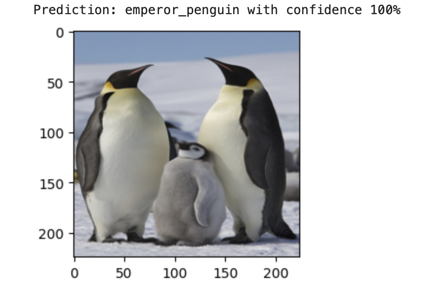

# Penguin species classification (Cap project for ML Zoomcamp)
This project has been completed as part of the ML Zoomcamp ran by [DataTalks.Club](https://datatalks.club). 



In this project we will try to create an ML model that would be able to take a photo of an adult penguin and determine its species. We will only work with **13 particular species**, namely, Emperor penguin, Adelie penguin, Chinstrap penguin, Southern rockhopperpenguin, Northern rockhopperpenguin, Fiordland penguin, Snares penguin, Macaroni penguin, Yellow eyed penguin, African penguin, Humboldt penguin, Magellanic penguin and Galapagos penguin. To determine the best model we use the **F1-score** metric. 

## The summary of the project: 
1. **Data collection.** Since we have not found a suitable existing dataset, we had to create one. This was done by scraping Google Images and manual cleaning. The result is provided as a Kaggle dataset [here](https://www.kaggle.com/datasets/nordskova/penguin-species-photos/). 
2. **Data augmentation and preprocessing.** Since after scraping we ended up with highly unbalanced classes, we augment each class to have 300 images in total by applying random rotations, flips and crops. Then we split the data into train and validation parts, rescale the images and turn them into tensors suitable for training of Pytorch models. 

3. Next we fine-tune several pre-trained models: Resnet50, MobileNet V2 and Resnet101. **Resnet50** Adding custom classification layers on top, freezing other layers and training for 100 epochs with Cross Entropy as loss function and Adam optimizer with learning rate 0.0001. The resulting F1-score is **0.95**. 
4. **MobileNet v2**. We try two different variations: training the model as is for 30 epochs, using the same loss function and optimizer as for Resnet50, and adding custom classification layers on top instead of the last layer and training the model for 80 epochs with Negative Log Likelihood loss as loss function. In the first case the F1-score was **0.88**. In the second case it was
5. **Resnet101**. Adding one fully connected layer, training for 60 epochs with Cross Entropy loss and SGD optimizer with momentum. The resulting F1-score was **0.84**. 


The best model (MobileNet V2) was saved (see **mobnet_model.pth** in the directory). 

*All these steps are contained in the notebook* **peng_project_notebook.ipynb**. If your browser does not render the notebook in GitHub, you can download the file and open it locally or use [nbviewer](https://nbviewer.org/). 


5. **Local deployment.** The model is deployed as a web service using Flask (**app.py**). To make it more user friendly, we employ *render_template* and create a simple html page (provided in the subfolders **"templates** and **static**) with a form to which you can submit your reddit comment directly in your browser. As an alernative, we have another script **predict.py** which gets its data for predictions from **test.py**. The application is containerized via Docker. Below you can see the instuctions on how to build and run the project with or without Docker. 

## How to run the project locally (without Docker): 
1. Clone the repository: 
```  git clone https://github.com/nordskova/mlzoom_cap2_proj ```
For the following steps you should be in the corresponding repository (use ```cd``` if you are not). 
2. In you haven't already, install pipenv: ``` pip install pipenv```  
You can check it by running ``` pipenv --version```  
3. Create a virtual environment and install all necessary packages from **Pipfile** by running  ```  pipenv install ```. 
4. Activate your virtual environment: ```  pipenv shell```. 
5. Run ``` python3 app.py``` .
6. Go to ```http://127.0.0.1:8000``` in your browser. 
7. Enter your image's url and see the predicted species! 


PICS HERE

Here as an example we use a fresh picture from the Instagram account of Otaru Aquarium (Japan). 

## Running the project with Docker: 
1.  Clone the repository: 
```  git clone https://github.com/nordskova/mlzoom_cap2_proj ``` For the following steps you should be in the corresponding repository. 
2. Make sure you have Docker installed: ```docker --version``` If you don't, first follow the instuctions [here](https://docs.docker.com/desktop/). Run and Docker daemon if your system doesn't do it automatically. 
3. Build a Docker image with ```docker build -t sarcasm .``` It will automatically collect all required packages and dependencies from **requirements.txt**. 
4. Now run it with ```docker run -it -p 9696:9696 sarcasm:latest``` 
5. In a new tab of the terminal/command line, run ```python3 test.py```. You will get a reply like this:  ```{'Reddit comment: ': 'Life is good!', 'Result:': 'The comment is likely sincere. The confidence is 0.7231289148330688'} ```
6. To get a new prediction, go to **test.py** and change the following line: 
 ```data = {"text": "Life is good!"}```, replacing "Life is good!" with your Reddit comment. Then run **test.py** again. 


PICTURES HERE

## Cloud deployment 
The project was deployed to a local kubernetes cluster with minikube. Here we describe the process step by step. 

1. Make sure you have [homebrew](http://https://brew.sh) installed (if not, install it). 

2. Install minikube and kubectl: 

 ```brew install minikube```
 
 ```brew install kubectl```
 
3. Then run (Docker daemon should be running): 

```eval $(minikube docker-env)```

4. Now build a Docker image inside Minikube with:  

``` minikube cache add python:3.11.1``` 

```docker build -t peng .```  

5. You can run ```docker images``` to make sure your image has been built successfully. 
6. Then deploy your app: 

```kubectl apply -f deploy.yaml```

7. Finally, expose it:

```kubectl expose deployment flaskapi-peng-deployment --type=NodePort --port=9696```

8. Run ```minikube service flaskapi-peng-deployment``` to see the information about your service. Copy the URL provided here (for me it is ```http://127.0.0.1:63949```): 

PICTURE HERE

9. Go to **test.py** file. Replace ```url = 'http://localhost:9696/predict'``` with ```url = '[URL]/predict'``` (in my case ```url = 'http://127.0.0.1:63949/predict'```). 

10. In a new tab of your terminal/command line, run ```python3 test.py```. To get a new prediction for your Reddit comment, edit the variable ```text``` in **test.py** accordingly and run it again. 


## Future plans 

As I progress in learning ML and especially DL, I plan to improve the model, testing other variations of the models I used this time (e.g. other loss functions, adding more custom layers), as well as other pre-trained models and perhaps try to build a model myself from scratch, just to see how well it behaves. 